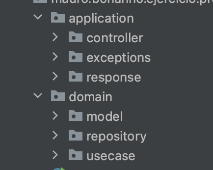
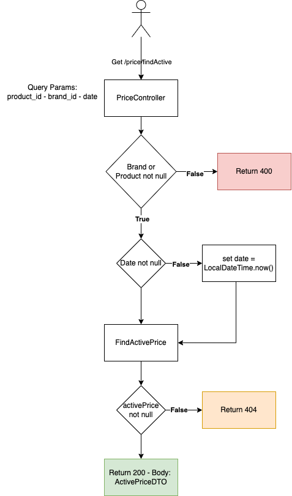
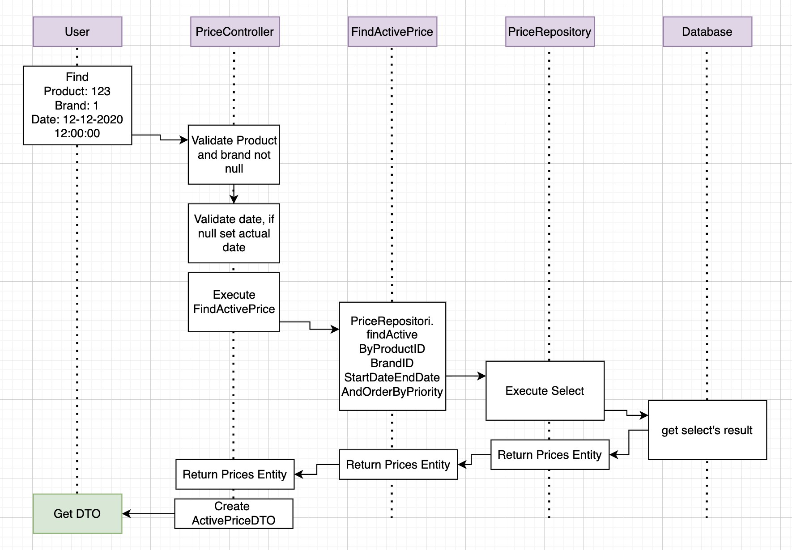

## Tecnologías Utilizadas
* Java 17
* Spring Boot 3.1.4
* Spring JPA
* Hibernate
* Mockito
* Database H2

## Objetivo
Crear una API Rest que devuelva el precio que corresponde al producto y marca en un momento determinado.
Estos precios van a estar guardados en la tabla **PRICES** la cual cuenta con las siguientes columnas:

## Diseño de la Aplicación
La aplicación va a contar con una división a nivel de paquetes para separar lo que es el controlador y sus recursos y 
otro para el dominio:

En **Application** vamos a encontrar el Controlador junto al Exception Handler, las excepciones que este va a manejar
y los DTO que va a responder. En el caso que el día de mañana se tenga que agregar DTOs en los request (Ejemplo un post)
se crea el package **request** y se agrega el DTO. Esto es para tener diferenciado los DTOs de entrada y salida.

En **Domain** vamos a encontrar 3 packages:
* Model: se encuentran las entidades que representan a las tablas de base de datos, en este caso encontramos solamente **PRICES**
dado que la tabla BRAND para nuestro caos de uso no es necesario. 
* Repository: Se encuentra el repositorio JPA para el select que tenemos que realizar.
* Usecase: contiene los casos de uso de la aplicación, en este caso es uno solo que es el de ir a buscar el precio activo
del artículo que se quiere buscar.  

## Solución
La tabla se creó con la PK de PRODUCT_ID - BRAND_ID - START_DATE - END_DATE - PRIORITY dado que se entiende que no se puede cargar un mismo
producto para la misma marca en donde las fechas sean iguales e igual prioridad, dado que se espera obtener un solo resultado
porque se entiende que solo puede haber un precio Activado (el de mayor prioridad). También se agregan 2 índices que pueden
ser útiles en un futuro, el buscar solo por BRAND_ID o PRODUCT_ID.

Luego para obtener el resultado válido se hace desde la siguiente Query:

    SELECT * FROM PRICES WHERE PRODUCT_ID = :product_id AND BRAND_ID = :brand_id AND START_DATE <= :date AND END_DATE > :date ORDER BY PRIORITY LIMIT 1;

Se obtiene el de mayor prioridad al realizar el orden descendiente por este campo. 
Otra posibilidad de esta query si se quiere evitar el limit 1 y el orden, es realizar una subquery obteniendo la prioridad máxima:

    SELECT * FROM PRICES WHERE PRODUCT_ID = :product_id AND BRAND_ID = :brand_id AND START_DATE <= :date AND END_DATE > :date 
    AND PRIORITY = (SELECT MAX(PRIORITY) FROM PRICES WHERE PRODUCT_ID = :product_id AND BRAND_ID = :brand_id AND START_DATE <= :date AND END_DATE > :date);

## Consideraciones asumidas
* Se creó la tabla BRAND en la base de datos dado que en el ejercicio se aclara que el BRAND_ID es una Foreign Key, entonces para tener la 
mejor representación de lo que pedía aunque esta no es utilizada en el servicio y por eso no se creó en el domain.
* La columna Rate se agregó ya que se pedía que esta sea retornada, se agregó en **PRICES** dado que me faltaba información de que es la lista
de precios, dado que esto podía ser otra tabla con esta información.
* Siempre la búsqueda va a ser con PRODUCT_ID y BRAND_ID, por lo que estos son obligatorios en el GET, no así la fecha donde asumí que si no se manda
se va a buscar por la fecha del momento que se está haciendo la llamada a la API.

## Desarrollo
1. Se creó un branch feature donde se subió la estructura básica del proyecto con los .sql a utilizar teniendo la aplicación ya "funcionando" 
se podía levantar y luego acceder a h2 para ver las tablas y su información.
2. Se creó otro Branch en el cual se desarrolló la lógica, para esto primero se crearon los tests funcionales y las firmas del controlador y el 
caso de uso que se iba a utilizar y se subieron estos cambios.
3. Para luego realizar la lógica del Controller, el servicio y la interfaz del JPA con sus tests.
4. Una vez que pasaron todos los tests, validé que la cobertura de tests este en los archivos creados al 100% además de probarlo de forma local. 

## Mejoras
    *   Se puede cambiar el formato de json que se retorno, seteando el Price como otro DTO que sea PRICE y adentro el monto y moneda, para identifijar de forma 
    más clara que estos 2 campos forman el precio.
    *   Analizar el poder agregar una caché para evitar recurrir siempre a la Base de Datos (puede ser Spring-Caché), esto no fue agregado en este momento
    dado que al tener las horas, minutos y segundos se tiene que analizar bien como poder implementarla en esta consulta.
    *   Agregar perfiles a la aplicación para poder tener a su vez una mejor separación en el caso de que se necesite utilizar otro tipo de base de datos,
    para esto la idea seria agregar un tercer package al nivel de domain y application que sea architecture y ahí agregar lo que es configuración
    por perfil y base de datos.
